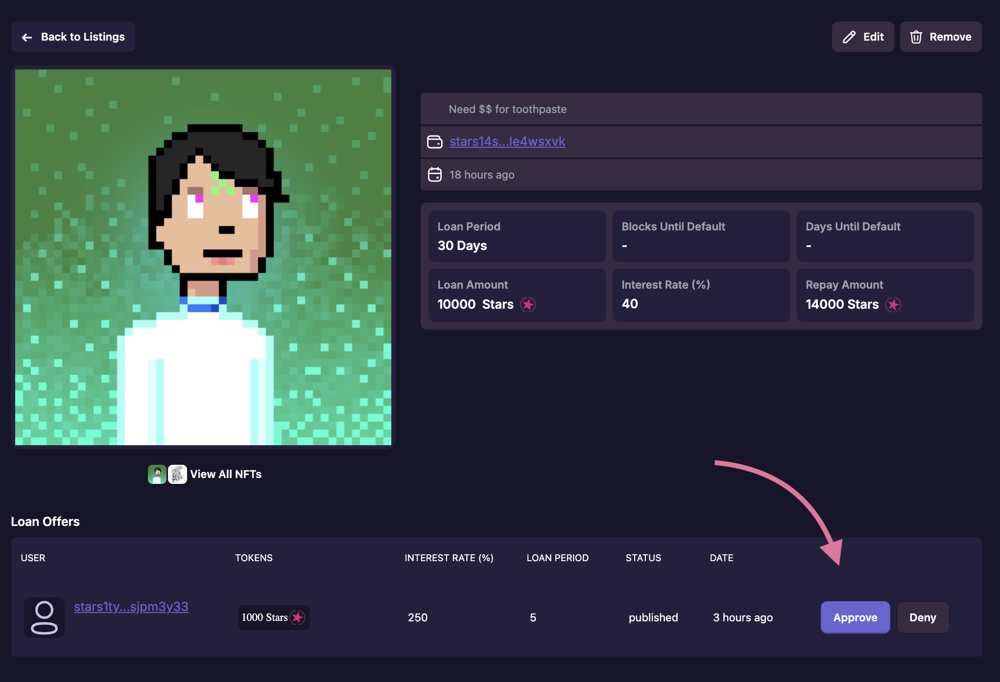

# Accepting a Loan Offer

Once accepted, the collateral is sent to the the nft-loan contract in escrow, and the assets being lended are immediately sent to the borrower.

## [Roadmap](../introduction/atlas-dapp/roadmap)