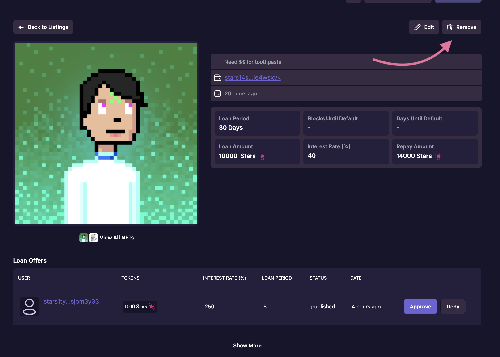

# Cancelling Offers & Listings

Sometimes you may want to cancel offers or listings that you’ve made. You can do this at any time as long as an offer has not yet been accepted by a borrower, or if the loan has not already been fundeds.

## [Roadmap](../introduction/atlas-dapp/roadmap)