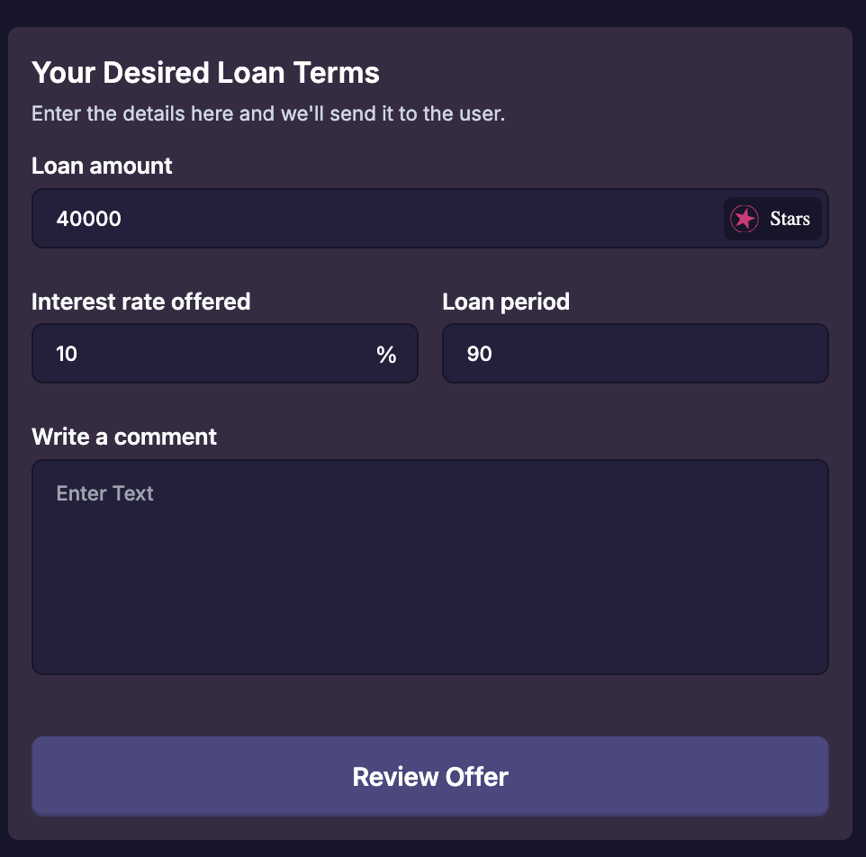

# Creating a Loan Offer

Some borrowers will have indicated their desired loan term. If you wish to **provide alternative loan terms** that you prefer, you may do just that!

#### To Make A Loan Offer:

1. Navigate to the loan you wish to make an offer on.

2. Call the `make_offer`  function with the desired **[loan terms](./listing-collateral#loan-terms)** provided.

Review & broadcast your offer once you are certain you want to offer the terms defined. 
## [Roadmap](../introduction/atlas-dapp/roadmap)