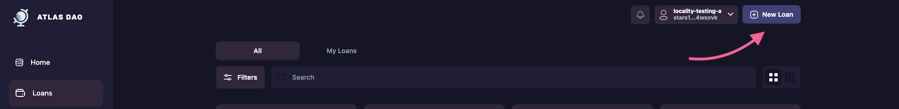
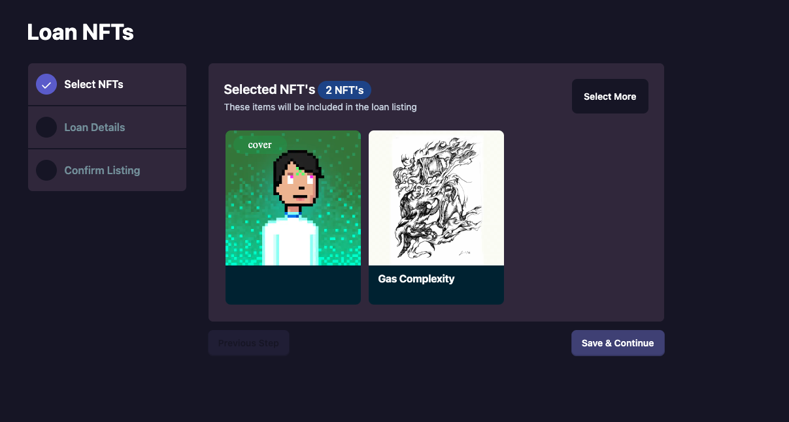
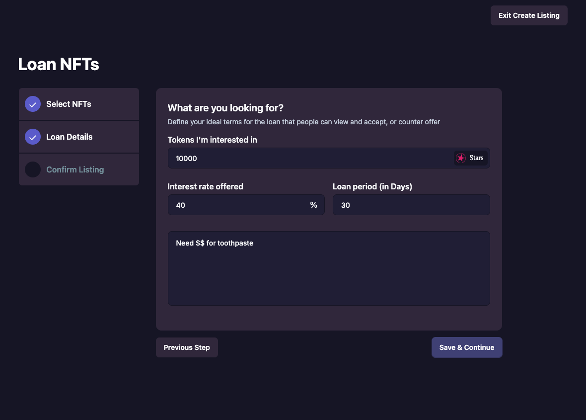

# Listing A Collateral 
A borrower may list various assets as collateral & signal their desired terms. This allows anyone to either **fund a loan**, or **make an offer** on the new loan listing.

### Supported Collateral Assets:
* Stargaze Sg721 Contracts
* CosmWasm Cw721 Contracts
* Native & IBC Tokens
* coming soon: ?

### Loan Terms

* **principle -** the initial assets being borrowed
* **interest  - %** interest from the principle
* **duration -** blocks loan term is active

### To List A Collateral & Define Desired Loan Terms:

1. Navigate to the **create-new-loan** page.

2. Decide which assets you are to put up as collateral, & then continue to the next page

3.  Select your desired Loan Terms:

    a. **Principle: `all IBC supported coins`**\
    b. **Interest: `% of principle to be required during repayment`**\
    c.  **Duration: `total blocks in loan lifecycle`**

4. Confirm the new `ListCollateral` msg. The ui creates the msgs to approve the loan contract to transfer the nft into escrow, upon a loanTerms being accepted & funded.

:::info
**GAS & FEE NOTICE:** _**your tx will fail unless you provide ONLY the exact fee configured.**\
These values will be provided to the front end through the key-object storage of the AtlasDAO_
:::

## [Roadmap](../introduction/atlas-dapp/roadmap)