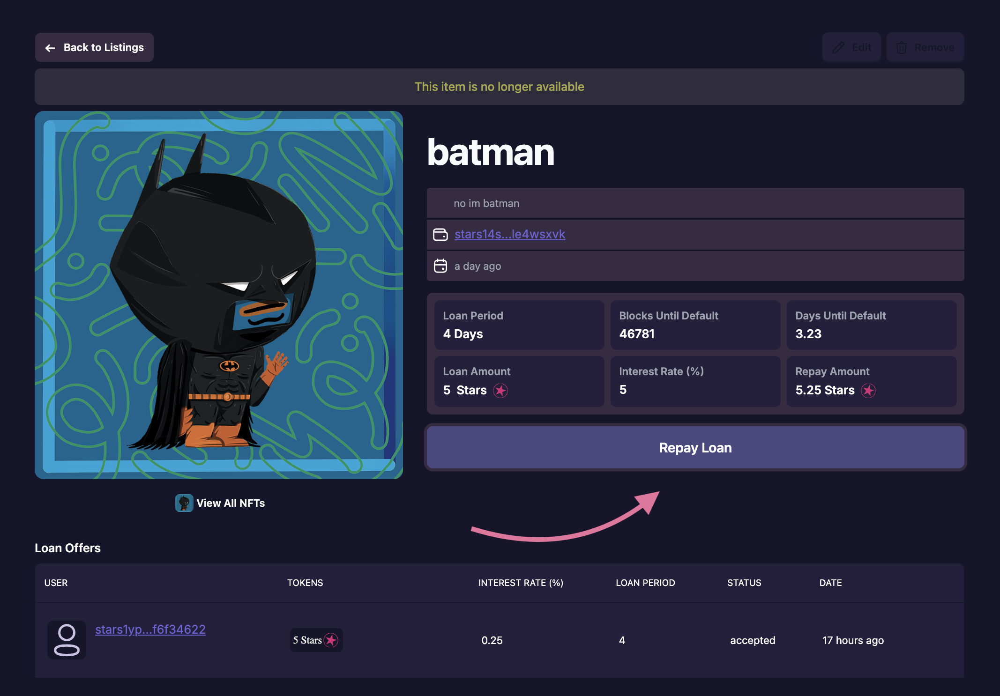

# Repaying Loans

A loan can only be paid by sending a message to the loan-contract. If a borrower tries to send funds to a lender directly, the loan-contract does not register this repayment, and you collateral will now be in control of the borrower. 

## [Roadmap](../introduction/atlas-dapp/roadmap)