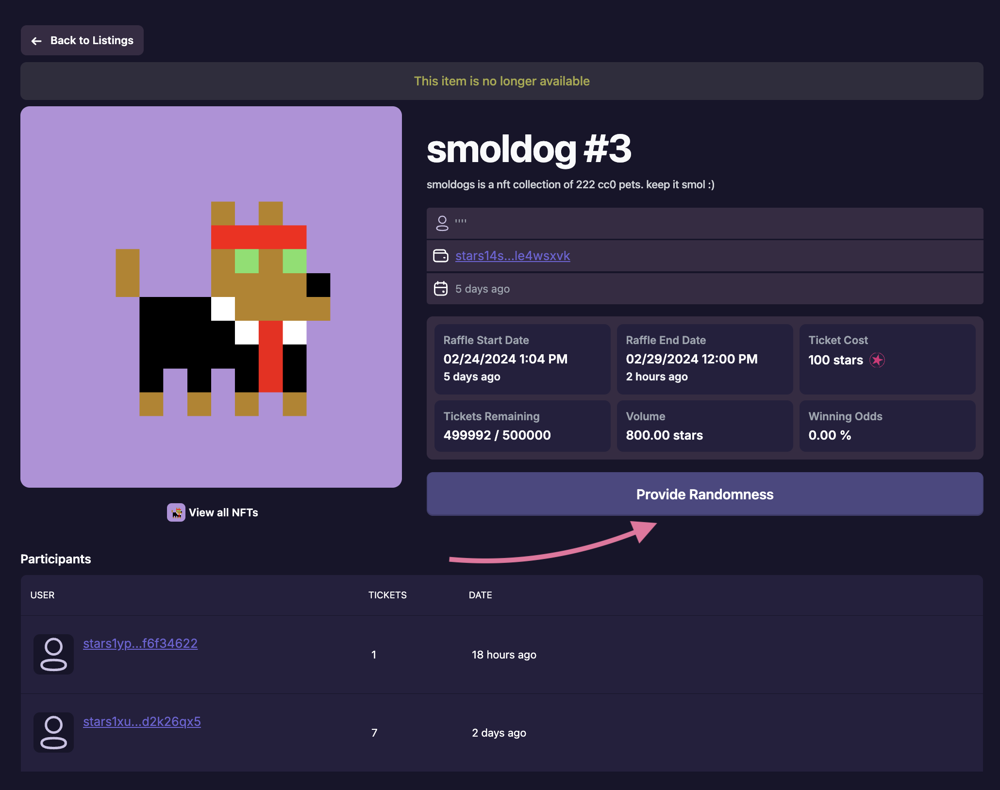

# Calculating The Winner
After the raffle concludes, a winner is randomly selected, and the NFT can be claimed from the escrow contract.

## Verifiable Randomness Source
Each raffle will request for a randomness seed from provide the sent from nois.network. There is no way for a raffle winner to be determined until the randomness has been provided, **ensuring that randomness is not predicatable, and actually random.** 

## Determining the Winner
Once a request for randomness has been provided, we can then call the contract to determine the winner. A successful msg will determine the winner, send the nft to the winnner, calculate the ticket sales tax going to AtlasDAO, and distribute the allocations to the raffle owner and the AtlasDAO treasury.

## [Roadmap](../introduction/atlas-dapp/roadmap)