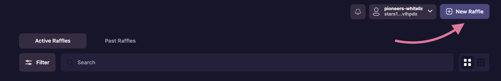
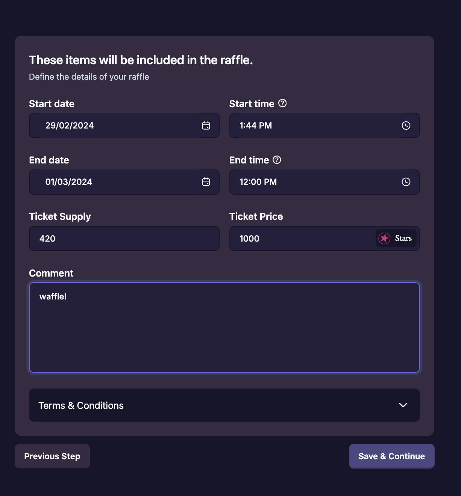

# Creating A Raffle

Initiate a raffle by selecting an NFT from your collection, custom parameters for extended control of your raffle. 

Parameters include:
* **Raffle Start Time & Date:** When ticket sales begin
* **Raffle End Time & Date:** When ticket sales end
* **Ticket Supply:** total supply of tickets (defaults to 100,000 if no value is provided)
* **Ticket Price:** Minimum raffle ticket cost is 1 Stars
* **Asset for ticket purchase:** what token do you want tickets to be purchased in

## [Roadmap](../introduction/atlas-dapp/roadmap)